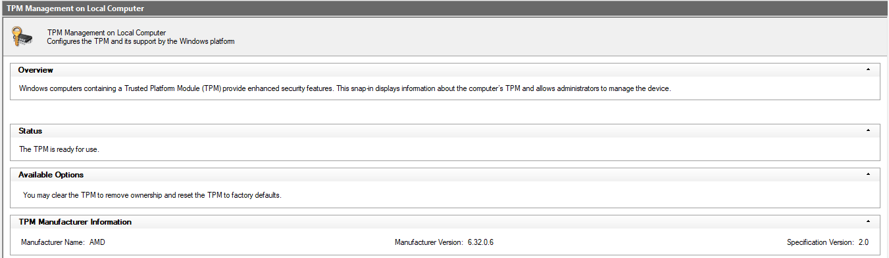
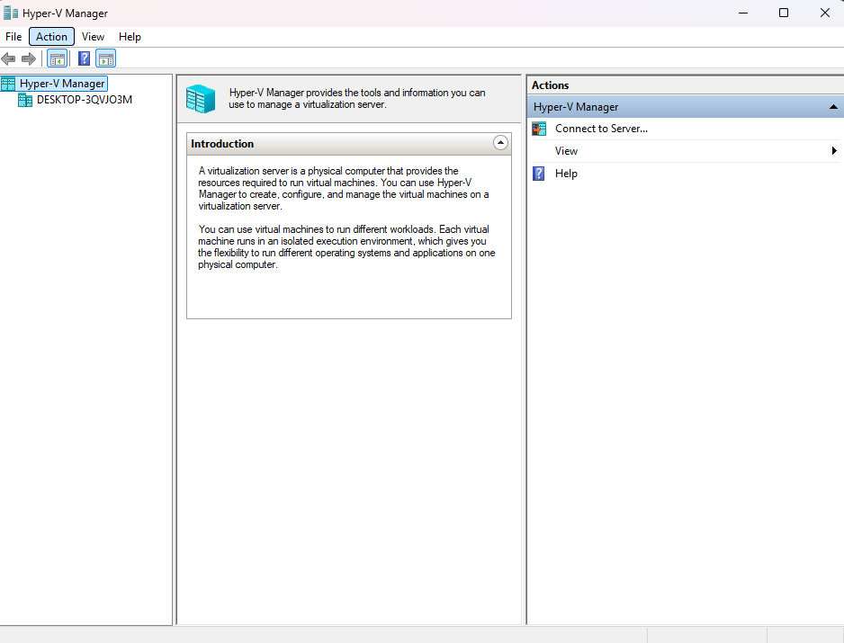
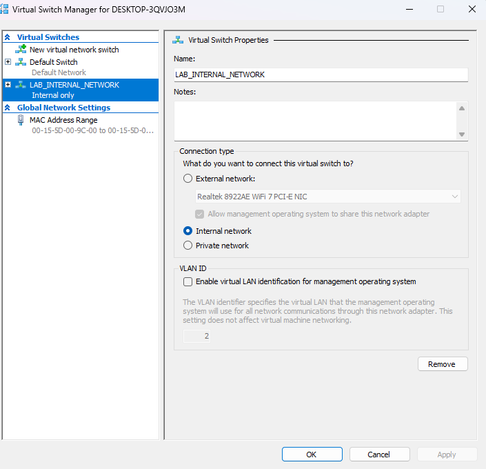
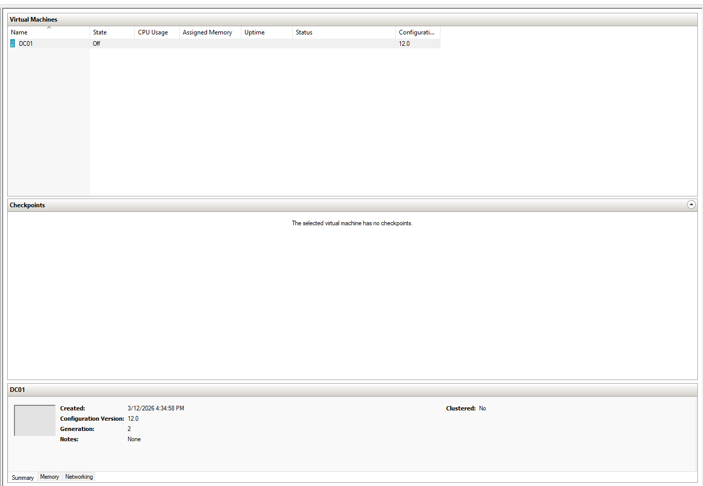

# Lab-01-Identity-Infrastructure-Foundation

Hands-on Identity and Access Management (IAM) lab series covering Hyper-V infrastructure, Active Directory, authentication, access control, and hybrid identity with Microsoft Entra ID.

---

## Lab Scope

This foundational lab combines three infrastructure preparation stages:

• Host virtualization readiness  
• Hyper-V infrastructure configuration  
• Windows Server domain controller deployment  

These steps establish the environment required for building and managing an Active Directory identity infrastructure.

---

## Lab Environment

Host Machine
- Windows 11 Pro
- AMD Ryzen 5 7600X3D
- 32 GB RAM

Virtualization Platform
- Hyper-V

Virtual Machine
- Windows Server 2022
- Domain Controller: DC01

## Lab Steps

### 1. Verified Host Hardware Specifications

---

### 2. Confirmed System Architecture

---

### 3. Verified Host Operating System Version

---

### 4. Verified TPM Availability

---

### 5. Confirmed BitLocker Encryption

---

### 6. Verified CPU Virtualization Support

---

### 7. Confirmed Hyper-V Installation

---

### 8. Opened Hyper-V Manager

---

### 9. Created Internal Lab Network

---

### 10. Created Hyper-V Lab Folder Structure

---

### 11. Configured Hyper-V Storage Paths

---

### 12. Prepared Windows Server 2022 Installation Media

---

### 13. Configured Domain Controller Virtual Machine

---

### 14. Created the DC01 Virtual Machine

