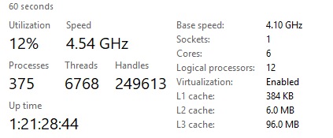
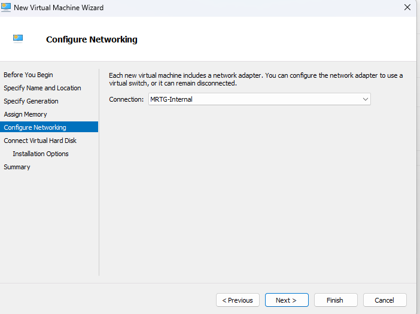
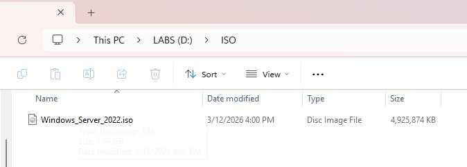
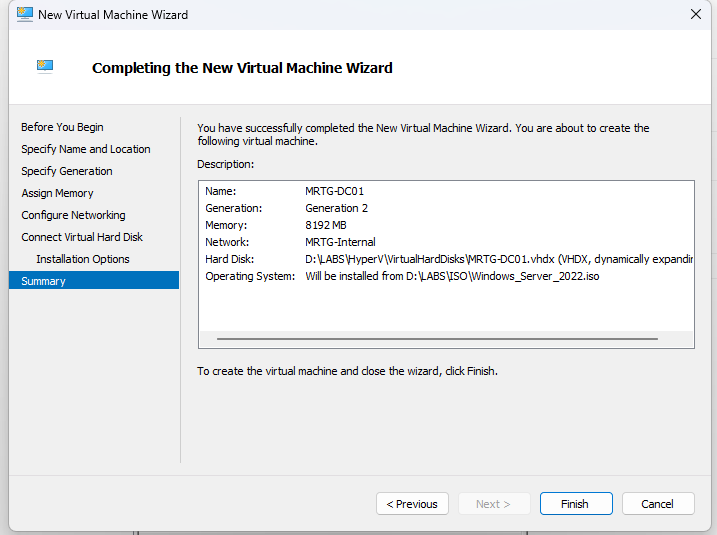

# Lab-01 — Virtualization and Identity Infrastructure Foundation

## Overview

This lab establishes the identity infrastructure foundation for the MRTG enterprise IAM environment.

A controlled virtualization platform was prepared to support Active Directory Domain Services (AD DS), ensuring secure, isolated deployment and policy-based identity management.

---

## Why This Matters

Enterprise identity systems require controlled infrastructure boundaries.

A properly configured virtualization host ensures:

- Isolation between host and domain environment  
- Secure deployment of Active Directory  
- Controlled authentication and access control testing  
- Expansion capability for future IAM services  

This foundation establishes the security boundary for centralized identity management.

---

## Environment

| Component           | Value                  |
|--------------------|-----------------------|
| Host OS            | Windows 11 Pro        |
| Hypervisor         | Hyper-V               |
| Domain Controller  | Windows Server 2022   |
| VM Count           | 2                     |
| Network            | Internal Virtual Switch |

---

## Architecture

### Host Layer
- Windows 11 Pro  
- Hyper-V enabled  
- BitLocker encryption enforced  

### Virtualization Layer
- Hyper-V Manager  
- Internal Virtual Switch (isolated network)  

### Planned Identity Role
- Primary Domain Controller (AD DS, DNS)

---

## Security Controls Implemented

- Hyper-V used to isolate host and lab environments  
- BitLocker enabled on host system  
- Standard user model enforced (administrative tasks restricted)  
- Internal virtual switch to prevent external exposure  

These controls establish a secure boundary for enterprise identity deployment.

---

## Implementation & Validation

### 1. Host Resource Validation

The host system hardware was validated to ensure sufficient CPU and memory resources for virtualization workloads.

---

### 2. Platform Architecture Validation

The system architecture was verified to ensure a 64-bit operating system capable of supporting Hyper-V virtualization.

---

### 3. Verified Host Operating System

The host system is running Windows 11 Pro, which supports Hyper-V virtualization and enterprise security features.

---

### 4. Verified TPM Availability

Trusted Platform Module (TPM) availability was confirmed to support hardware-based security features such as BitLocker.

---

### 5. Verified BitLocker Encryption

BitLocker encryption was verified on the operating system drive to ensure host system data protection.

---

### 6. Verified CPU Virtualization Support

CPU virtualization support was confirmed to ensure the processor can support Hyper-V virtual machines.

---

### 7. Hyper-V Feature Validation

Hyper-V was verified as installed with both the platform and management tools enabled.

---

### 8. Opened Hyper-V Manager

Hyper-V Manager was launched to begin configuring the virtualization environment.

---

### 9. Created Internal Lab Network

A dedicated internal virtual switch was created to isolate the lab network from the host network.

This allows domain services and authentication testing without impacting external systems.

---

### 10. Created Lab Folder Structure

A dedicated folder structure was created on the LABS drive to organize virtual machine files and virtual hard disks.

This structure separates infrastructure resources from the host operating system.

---

### 11. Configured Hyper-V Storage Paths

Hyper-V default storage locations were configured to use the dedicated lab directories.

This ensures consistent storage management for future virtual machines.

---

### 12. Prepared Windows Server 2022 Installation Media

The Windows Server 2022 ISO image was downloaded and staged for deployment as the domain controller.

---

### 13. Configured Domain Controller Virtual Machine

A new virtual machine named **MRTG-DC01** was created with the following configuration:

- Generation 2  
- 8192 MB RAM  
- 2 vCPU  
- Internal virtual network (MRTG-Internal)  
- 80 GB dynamically expanding VHDX  
- Windows Server 2022 ISO attached  

This configuration establishes the baseline system that will later be promoted to a Domain Controller.

---

### 14. Created MRTG-DC01 Virtual Machine

The MRTG-DC01 virtual machine was successfully created within the Hyper-V environment and is ready for Windows Server installation.

---

## Outcome

A secure virtualization boundary was successfully established to support enterprise Active Directory deployment.

The MRTG-DC01 virtual machine was provisioned and prepared for Domain Controller promotion.

This environment now serves as the controlled identity boundary for authentication, authorization, and policy enforcement within the MRTG IAM architecture.

---

## Next Lab

[Lab-02 — Active Directory Domain Services (AD DS) Deployment](../Lab-02-AD-DS-Deployment/README.md)

The next lab will cover:

- Installing the Active Directory Domain Services (AD DS) role  
- Creating a new domain forest  
- Configuring DNS for the domain environment  
- Promoting the server to a Domain Controller  
