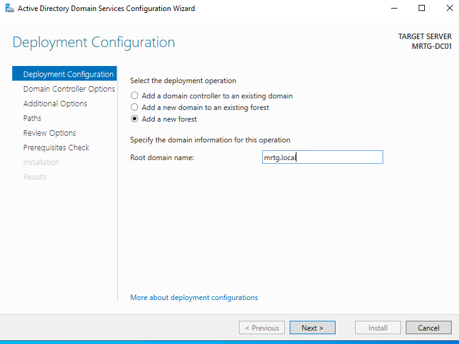
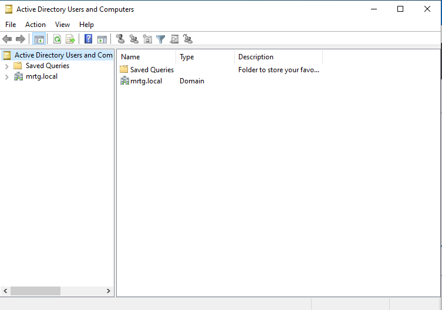
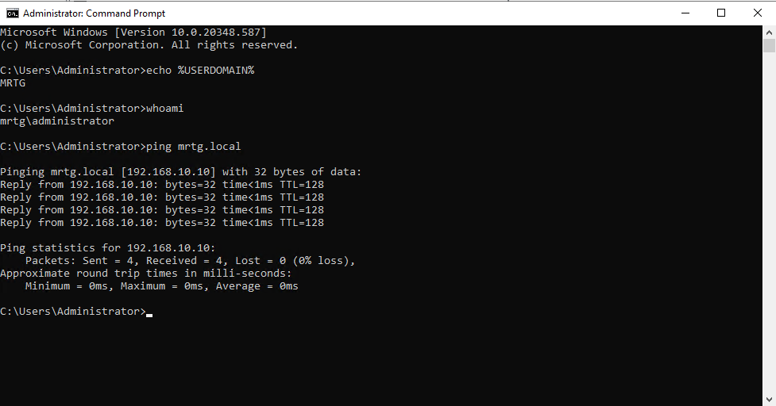

# Lab 03 — Active Directory Domain Setup (Identity Authority Foundation)

## Overview

Monroe Redstone Technology Group (MRTG) established its centralized identity system by promoting Windows Server to a Domain Controller and creating the internal domain `mrtg.local`.

This lab builds directly on Lab 02 by activating identity services, enabling authentication, authorization, and service discovery within the environment.

---

## Objective

Promote Windows Server to a Domain Controller and establish the MRTG Active Directory domain (`mrtg.local`) as the centralized identity authority.

---

## Scope

### Included
- Domain controller promotion (new forest: mrtg.local)
- DNS configuration (AD-integrated)
- Domain authentication validation
- Name resolution testing
- Domain controller health checks
- Hyper-V checkpoint creation

### Not Included
- Organizational Unit (OU) design
- User and group provisioning (beyond default accounts)
- Group Policy Object (GPO) configuration
- Domain-joined workstation setup

---

## Environment

| Component | Value |
|----------|------|
| VM Name | MRTG-DC01 |
| OS | Windows Server 2022 |
| Role | Domain Controller |
| Domain | mrtg.local |
| DNS | AD-integrated |

---

## Architecture

The MRTG-DC01 server functions as the first domain controller within the `mrtg.local` forest, providing:

- Active Directory Domain Services (AD DS)
- AD-integrated DNS

This system acts as the centralized identity provider responsible for:

- Authentication (Kerberos)
- Authorization (security principals)
- Service discovery (DNS)

This establishes the identity control plane for MRTG.

---

## Deployment Phases

### Phase 1 — Domain Controller Promotion

The server was promoted to a domain controller by creating a new Active Directory forest (`mrtg.local`).

This action establishes the Active Directory forest, which defines the security boundary and identity namespace for the environment.

---

### Phase 2 — Prerequisite Validation

Prerequisite checks were completed successfully prior to domain controller promotion.

---

### Phase 3 — DNS Configuration

AD-integrated DNS zones were automatically created during promotion, including the primary domain zone and `_msdcs` zone.

These zones enable domain controller discovery and are required for Kerberos authentication workflows.

---

### Phase 4 — DNS Service Records Validation

DNS service records confirm proper domain controller registration and enable service discovery within the domain.

---

### Phase 5 — Network Configuration Validation

Verified static IP configuration and confirmed the domain controller is using itself for DNS resolution.

---

### Phase 6 — Authentication and Name Resolution Validation

Validated domain authentication context and DNS-based name resolution:

- Successful domain login using `MRTG\Administrator`
- Verified domain context (`whoami`, `%USERDOMAIN%`)
- Confirmed name resolution using `ping mrtg.local`

---

### Phase 7 — Infrastructure Baseline Checkpoint

A Hyper-V checkpoint was created to preserve a stable domain controller baseline for future labs.

---

## Outcome

- Successfully promoted server to Domain Controller for `mrtg.local`
- Established centralized identity authority using Active Directory
- Configured AD-integrated DNS for service discovery
- Validated authentication and domain connectivity
- Verified domain controller configuration and network settings

This lab establishes the identity control plane for MRTG, enabling centralized authentication and access control in subsequent labs.

This system now functions as a trusted identity authority within the MRTG environment.

---

## Security Perspective

The domain controller is a Tier 0 asset and represents the core of enterprise identity infrastructure.

Active Directory relies on DNS for authentication workflows, making DNS configuration critical for both availability and security.

Compromise of a domain controller results in full domain compromise, emphasizing the need for strict access control, monitoring, and hardening in production environments.

Domain controllers must be treated as highly privileged systems (Tier 0) with restricted administrative access and continuous monitoring.

---

## Next Lab

Lab 04 — Organizational Units (OU) Design and Group Policy

Planned focus:
- OU structure aligned to business roles
- User and group provisioning
- Access control modeling using security groups
- Introduction to Group Policy (GPO)
