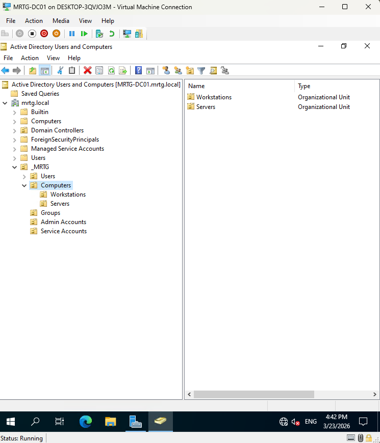
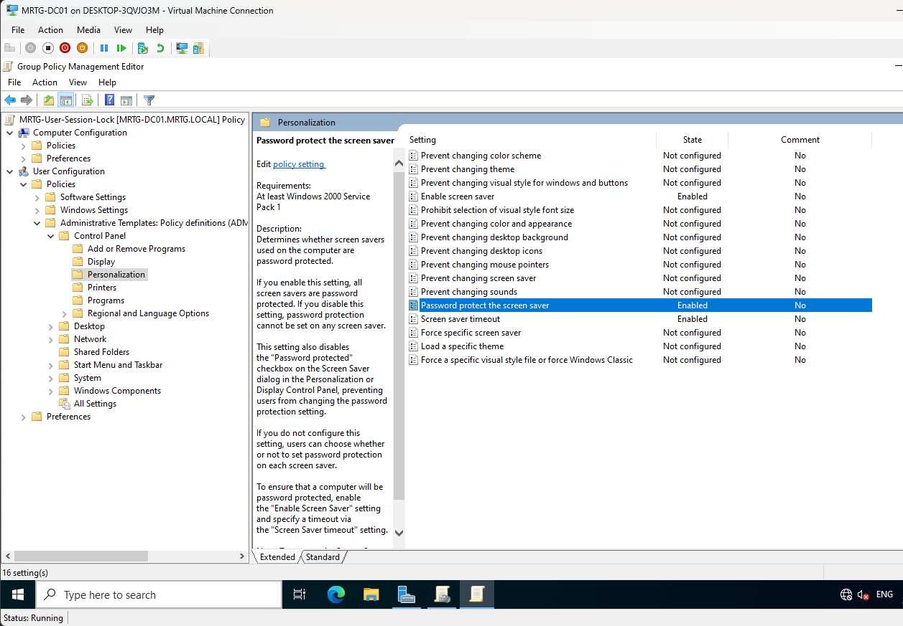
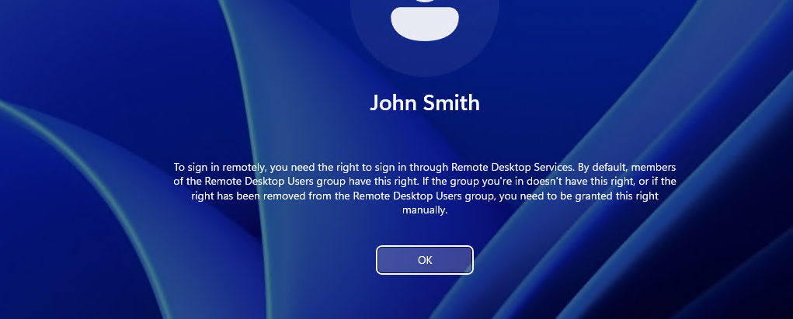
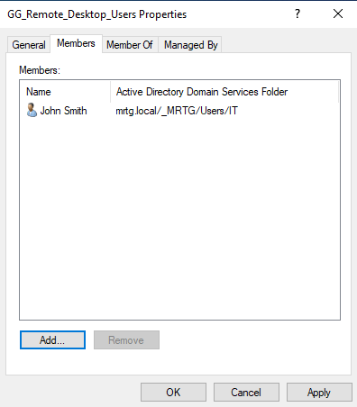

# Lab-04 — OU Design and GPO Enforcement (Access Control)

---


---

## Overview

This lab implements **policy-based identity governance** within the MRTG Active Directory domain using:

- Organizational Units (OUs)
- Group Policy Objects (GPOs)
- Security Group–based Role-Based Access Control (RBAC)

The environment transitions from a functional identity authority (Lab-03) to a controlled and governed identity system.

---

## Why This Matters

In enterprise and government environments, identity is governed through policy — not manual configuration.

Group Policy enables:

- Centralized configuration management
- Security baseline enforcement
- OU-based targeting
- Scalable access control
- Repeatable compliance enforcement

Without structured policy enforcement, identity systems become inconsistent and insecure.

---

## Environment

| Component | Value |
|------------|--------|
| Domain | mrtg.local |
| Domain Controller | MRTG-DC01 |
| Tools | Group Policy Management Console (GPMC) |
| Platform | Windows Server 2022 |

---

## Architecture

### Identity Infrastructure

- **Domain:** mrtg.local  
- **Domain Controller:** MRTG-DC01  
- **Directory Services:** Active Directory Domain Services (AD DS)  
- **Authentication Protocol:** Kerberos  

Active Directory functions as the centralized identity provider (IdP), enforcing authentication and authorization across domain-joined systems.

---

## Organizational Unit (OU) Design

The OU structure is aligned with business functions to enable targeted policy enforcement and delegated administration.

```text
mrtg.local
└── MRTG
    ├── Users
    │   └── IT | Security | HR | Finance | Operations | Engineering | Executives
    ├── Computers
    │   └── Workstations | Servers
    ├── Groups
    ├── Admin Accounts
    └── Service Accounts
```

This structure enables:

- Policy targeting by role and device type  
- Separation of administrative boundaries  
- Scalable identity governance  

---

## Group Policy Architecture

### Workstation Baseline GPO

Enforces:

- Password policy
- Account lockout policy
- User session lock controls

### Linking Strategy

- GPO linked to **Workstations OU**
- Applies only to domain-joined endpoints

### Scope & Filtering

- Security filtering via **Authenticated Users**
- Ensures correct policy targeting

---

## Access Control Model

Access is governed through **security group membership**, implementing Role-Based Access Control (RBAC).

### Example

**GG_Remote_Desktop_Users**

- Grants RDP access
- Permissions assigned via group membership
- No direct user-level permissions

This enforces:

- Centralized access management
- Reduced administrative overhead
- Consistent least-privilege enforcement

---

## Policy Enforcement Flow

1. User logs into domain-joined system  
2. Authentication handled by Domain Controller (Kerberos)  
3. Applicable GPOs retrieved  
4. Access decisions enforced via:
   - OU placement
   - Group membership
   - GPO configuration  

This reflects real-world enterprise IAM environments.

---

# Implementation & Evidence

---

### 1. Designed Organizational Unit Structure


---

### 2. Implemented Computer OU Segmentation



---

### 3. Joined Client Machine and Placed in Workstations OU


---

### 4. Configured Password Policy

- Password history enforced
- Minimum length configured
- Complexity requirements enabled


---

### 5. Configured Account Lockout Policy

- Lockout threshold defined
- Lockout duration configured
- Reset counter configured


---

### 6. Configured User Session Lock Policy

- Screen saver enabled
- Password protection enforced
- Idle timeout configured



---

### 7. Linked GPO to Workstations OU


---

### 8. Configured GPO Scope & Security Filtering


---

### 9. Validated Computer Policy Application

---

Validated using:

```powershell
gpresult /r
```
---


---

### 10. Validated User Policy Application


---

### 11. Simulated Access Control Failure (RDP Denied)



---

### 12. Implemented Group-Based Access Control



---

### 13. Validated Access Remediation


---

# Outcome

Policy-based identity governance successfully implemented.

- OU hierarchy structured for targeted policy application  
- Security baselines enforced via GPO  
- Policy application validated (computer and user level)  
- Access control enforced through group-based permissions  
- Least privilege model applied  

The environment now operates as a policy-driven identity system aligned with enterprise IAM standards.

---

# IAM / Security Perspective

This lab demonstrates:

- OU-based policy targeting  
- Role-Based Access Control (RBAC)  
- Security baseline enforcement  
- Access control through group membership  
- Validation using system tools (`gpresult`)  

Identity, policy, and access control are now integrated into a cohesive governance model.

---

## Next Lab

[Lab-05 — Identity Lifecycle Management](../Lab-05-Identity-Lifecycle-Management/)

Next phase introduces:

- User provisioning (Joiner process)
- Role changes (Mover process)
- Account deactivation (Leaver process)
- Identity lifecycle governance
