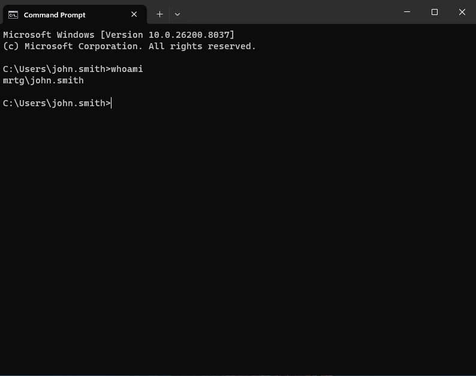

Lab-04 — OU Design and GPO Enforcement (Access Control)
---

## Overview

This lab focuses on implementing policy-based identity control within the MRTG Active Directory environment using Organizational Units (OUs) and Group Policy Objects (GPOs).

This phase introduces centralized policy enforcement, enabling standardized configuration, security controls, and scalable identity management across the domain.

This lab demonstrates how identity transitions from static objects to controlled and governed entities.

---

## Why This Matters

In enterprise and government environments, identity must be controlled through policy.

Group Policy enables:

- Centralized configuration management
- Enforcement of security baselines
- Identity-based targeting through OU structure
- Scalable and repeatable access control

Without policy enforcement, identity systems become inconsistent and insecure.

---

## Environment

| Component           | Value              |
|--------------------|-------------------|
| Domain Name        | mrtg.local        |
| Domain Controller  | MRTG-DC01         |
| Tools Used         | Group Policy Management Console (GPMC) |
| Platform           | Windows Server 2022 |

---

## Architecture

### Organizational Unit Structure

mrtg.local
│
└── _MRTG
├── Users
├── Computers
│ ├── Workstations
│ └── Servers
├── Groups
├── Admin Accounts
└── Service Accounts

---

## Lab Steps and Evidence

### 1. Designed Organizational Unit Structure

OUs were structured to align with business functions and enable targeted policy enforcement.

---

### 2. Segmented Computer Objects

Workstations and servers were separated into dedicated OUs to support policy targeting.

---

### 3. Placed Client System into Workstations OU

CLIENT01 was joined to the domain and placed into the Workstations OU for policy application.

---

### 4. Configured Password Policy

A password policy was configured to enforce baseline security requirements.

---

### 5. Configured Account Lockout Policy

Account lockout settings were configured to protect against brute-force attempts.

---

### 6. Configured User Session Lock Policy

A session lock policy was applied to enforce workstation security.

---

### 7. Linked GPO to Workstations OU

The MRTG-Workstation-Baseline GPO was linked to the Workstations OU to target domain-joined systems.

Policies were applied based on OU membership, demonstrating identity-based policy targeting.

---

### 8. Configured GPO Scope and Filtering

Policy scope was controlled using security filtering to ensure correct targeting.

---

### 9. Verified Computer Policy Application

Group Policy was applied and verified using `gpresult`.

---

### 10. Verified User Policy Application

User-level policies were confirmed to be successfully applied.

---

### 11. Tested Access Control Enforcement (RDP Denied)

A user without proper group membership was denied Remote Desktop access.

---

### 12. Assigned User to Remote Access Group

The user was added to the appropriate security group to grant access.

---

### 13. Validated Access Control Enforcement (RDP Allowed)

After group assignment and policy update, the user successfully authenticated and accessed the system via Remote Desktop.

The `whoami` command confirms the security context of the logged-in user.

---

## Outcome

Policy-based identity control was successfully implemented.

- OUs structured for targeted policy application
- Security baseline policies enforced via GPO
- Policy application validated at both computer and user levels
- Access control enforced through group-based permissions

This environment now supports scalable, policy-driven identity and access management.

---

## IAM / Security Perspective

This lab demonstrates how identity is governed through policy enforcement.

Key concepts implemented:

- OU-based policy targeting
- Role-based access control (RBAC)
- Security baseline enforcement
- Validation through system tools (`gpresult`)
- Access control through group membership

This reflects real-world enterprise IAM practices, where identity, policy, and access are tightly integrated.

---

## Next Lab

[Lab-05 — Identity Lifecycle Management](../Lab-05-Identity-Lifecycle-Management)

The next lab will cover:

- User provisioning (Joiner process)
- Role changes (Mover process)
- Account deactivation (Leaver process)
- Identity lifecycle governance

---
