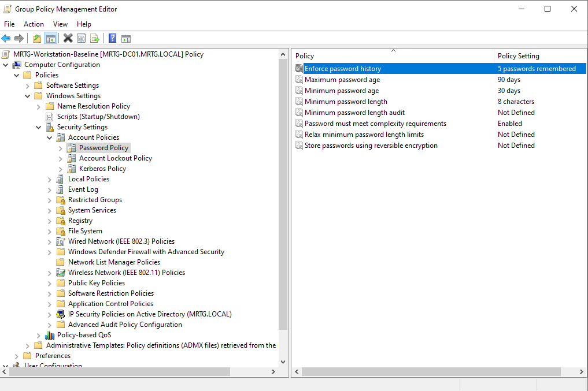
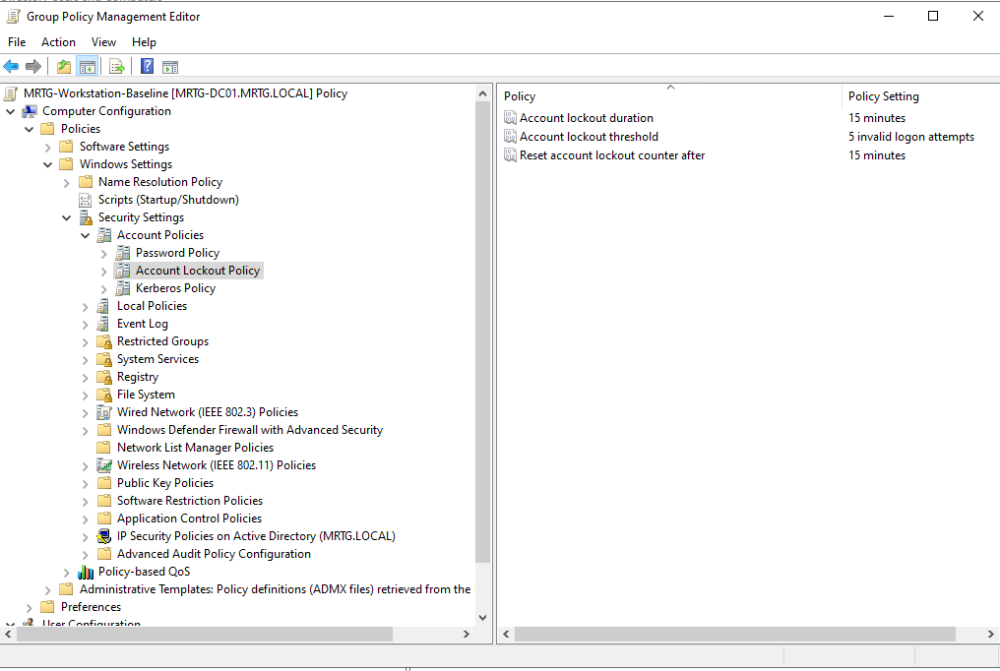
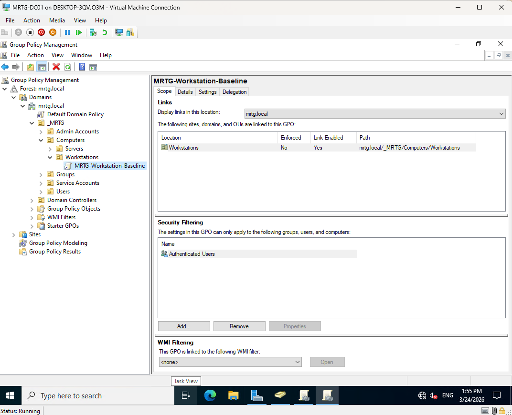
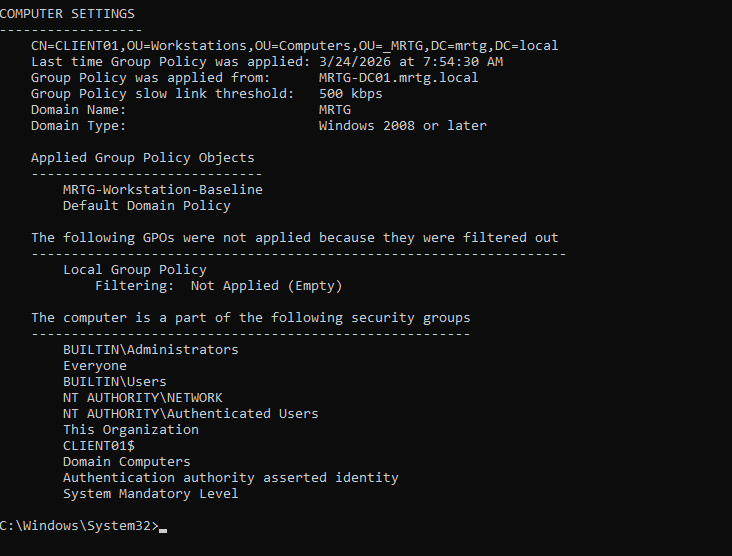
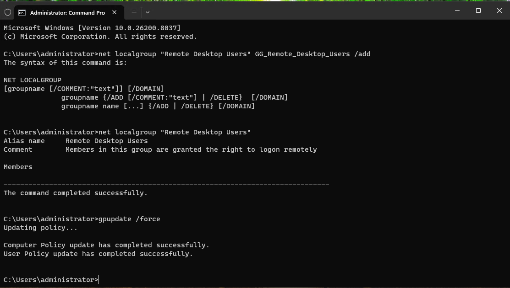
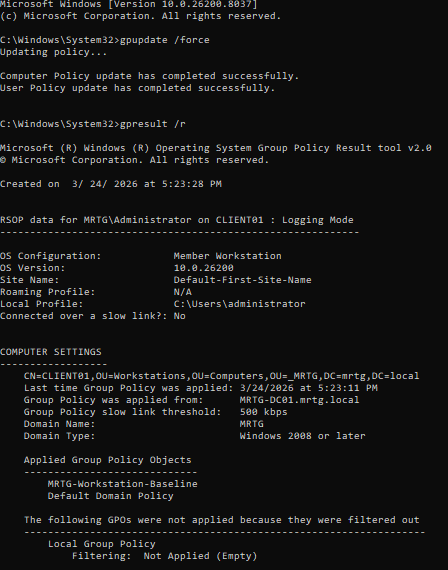

# Lab 04 — Organizational Unit (OU) Design and Group Policy

---

## Overview

In this lab, I implemented Group Policy Objects (GPOs) within the Monroe Redstone Technology Group (MRTG) environment to enforce centralized security configurations across domain-joined systems.

This lab demonstrates how identity-driven policy enforcement is used to control user and device behavior, a critical component of Identity and Access Management (IAM) in enterprise and government environments.

The approach aligns with enterprise security frameworks by ensuring consistent, auditable control over user sessions and endpoint configurations.

---

## Objective

- Deploy and configure Group Policy Objects (GPOs)
- Enforce security controls on domain-joined endpoints
- Validate policy application using `gpresult`
- Understand how Group Policy supports IAM governance and compliance

---

## Environment

| Component         | Details                              |
|------------------|--------------------------------------|
| Organization     | Monroe Redstone Technology Group     |
| Domain           | mrtg.local                           |
| Domain Controller| Windows Server 2019 (DC01)           |
| Client Machine   | Windows 11 (CLIENT01)                |
| Virtualization   | Hyper-V                              |

---

## Architecture

### Core Systems
- **DC01** — Domain Controller (AD DS, DNS, Group Policy)
- **CLIENT01** — Domain-joined workstation

### Organizational Unit Structure
- Users
- Groups
- Computers
- Admin Accounts
- Service Accounts

### Departmental Segmentation
- IT
- Security
- HR
- Finance
- Operations
- Engineering
- Executives

---

## Group Policy Configuration

A baseline workstation security policy was created and linked to the Workstations OU to enforce standard configurations.

### GPO Linked to Workstations OU

### Password Policy Configuration

### Account Lockout Policy Configuration

### GPO Scope and Security Filtering

---

## Policy Enforcement & Validation

To confirm that policies were successfully applied, Group Policy updates were forced and validated using command-line tools.

### Computer Policy Validation

### User Policy Validation

---

## Access Control Scenario

An access issue was simulated and resolved to demonstrate identity-based access control and troubleshooting.

### Initial Access Denied (RDP)

### Group-Based Access Assignment

### Policy Update and Remediation

---

## Final Validation

Final validation confirms that both computer and user policies were successfully applied after remediation.

---

## IAM & Security Analysis

This lab demonstrates how Group Policy functions as a centralized enforcement mechanism within an identity-driven environment.

### Key Concepts
- Centralized Access Control
- Least Privilege Enforcement
- Policy-Based Governance
- Audit and Validation

### Real-World Relevance
Group Policy is widely used in enterprise and government environments to enforce security baselines, manage endpoint configurations, and control user behavior in alignment with Zero Trust principles.

---

## Outcome

- Successfully deployed and linked Group Policy Objects
- Enforced security configurations on domain-joined systems
- Implemented identity-based access control using security groups
- Validated policy enforcement using `gpresult`
- Demonstrated troubleshooting and remediation of access issues

---

## Next Steps

The next phase will extend identity management into hybrid environments by integrating Microsoft Entra ID and cloud-based identity controls.
